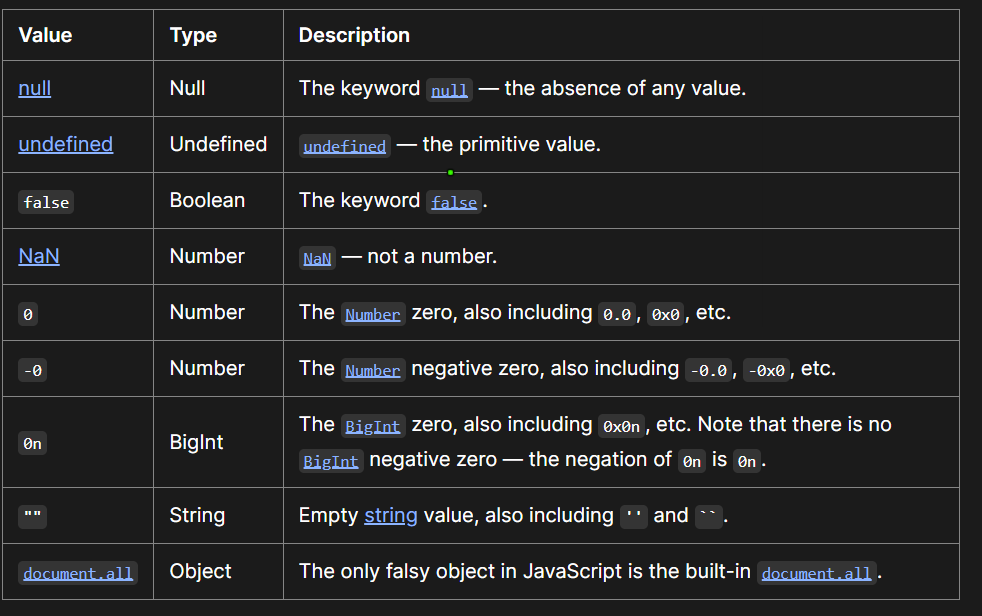

Biến: nơi giúp mình lưu trữ tạm lên bộ nhớ
+ với phiên bản ES5 thì dùng var(funtion scope) hiện tại js đang dùng là ES6 nên var không còn được dùng nữa
+ từ phiên bản Es6 thì dùng let(thì dùng cho biêns có mong muốn thay đổi giá trị) và const (thì dùng cho hằng số không có nhu cầu thay đổi) và luôn luôn dùng const cho dễ quản lý 

Cách đặt tên biến: 
+ dùng tiếng anh 
 + đặt tên để biết biến đó chứa gì
 + với true/flase thì đặt với is, has, show từ mang ý nghĩa chỉ có nhận giá trị true/false
 + với dạng danh sách thì dùng thêm List ở đằng sau 
 vd: 
 Const ProductName= 'a'; //tot

 let isSelected = true;

Case style:
 +camelCase : student,  studentList ( thường dùng cho đặt tên biến, tên hàm nói chung )
 +UPPER_CASE: PI, API-URL (thường dùng cho hàm số)
 +PascalCase: Menu, Sliderbar (thường dùng cho các class trong js)

Thuật toán js:
 +toán tử số học : a+b ; a%b
 +Unary: có 1 toán hạng count++
 +Binary: có 2 toán hạng: a=b; a +b
 +ternary: có 3 toán hạng : isShow? 'Show' : 'Hide'
 +logical: toán hạng luận lý : a||b; a && b
 +Bitwise: chuyên xử lý bit

  +ternary: condition ? exprIfTrue : exprIfFalse
  vd: const grade = mark > 8 ? 'GOOD' : ' BAD' hãy tránh lặp lại thì nó sẽ rất khó là đọc hiểu 

Các kiểu dữ liệu:
+ Number: int hoặc là float, interger được giới hạn bởi +-(2^53-1)
+ bigint: nó thường dùng cho những con số lớn
+ string: một chuỗi
+ boolean: cho dạng true flase
+ null: cho không biết giá trị 
+ undefined: cho những giá trị chưa được gán
+ symbol: 1 
+ object: thường dành cho dữ liệu phức tạp
dùng typeof để xác định kiểu duex liệu gì

Boolean:
+ tìm hiểu về type conversion vs type coercion: đều là chuyển đổi dữ liểu từ kiểu này sang kiểu khác 
  -type coercion Là ép kiểu tự động( ép kiểu ngầm )
  -type conversion có thể ép kiểu tự động hoặc ép kiểu do mình tự yêu cầu nó ép
  vd: 
  //type coersion 
  const a = 1 + '2';//'12' nó tự động nối  số 1 thành string '1' trước khi mà làm hành động
  const b = 1 - '2' // -1 nos tự động chuyển string '2' thành số 2 
  const message = ' Js is easy'
  if(message){ //thì khi đó cái message này sẽ tự động chuyển thành boolean 
    console.log("oke")
  }

  //type conversion
  const error = 'Something wrong';
  const hasError= Boolean(error): //thì cái này mình bảo nó là muốn biến đoạn chữ trên để chuyển sang thành boolean( dùng khi có giá trị nào đó về boolean )

  const mark = 9;
  const markString = mark.toString(); để chuyển đổi giá trị sang string

  const mark = "9";
  const markString = mark.parseInt(mark); //chuyển đổi từ string sang number
  // phổ biến hay dùng của type conversion:
  + string: .toString() or String()
  + number : parseint(), parseFloat()or Number()
  + boolean: ! 

Truthy vs Falsy
+truthy là những giá trị khi chuyển đổi về boolean thì sẽ được giá trị true 
+ Falsy: là những gí trị khi chuyển đổi về boolean thì sẽ được giá trị flase
 - cách xác định falsy thì có 1 danh sách thì ngoài danh sách đó thì sẽ là truthy
 
 link: https://developer.mozilla.org/en-US/docs/Glossary/Falsy
 đối với object{} thì lúc nòa cũng là true

Logical Operators
 dùng cho 1 số điều kiện  && là and
                          || or
                          ! Not
                          !! chuyển đổi giá trị hiện tại thành boolean
                          And table chỉ khi true khi cả 2 đều true
                          Or table chỉ khhi false khi cả 2 là False 
  + chuỗi cũng có tất cả các opetator so sánh như số, tuy nhiên cách so sánh chuỗi hơi khác biệt. So sánh theo từng kí tự 1 , từ trái sang phải 
     - nếu kí tự đầu tiền lớn hơn, thì string đó lớn hơn. 
     - nếu kí tự đầu tiên nhỉ hơn thì string đó nhỏ hơn
     - nếu kí tự đầu tiên giống nhau thì đi kiểm tra tiếp kí tự tiếp theo.
     - tiếp tục cho đến khi hết chuỗi.
     để kiểm tra kí tự nào lớn hơn: https://asecuritysite.com/coding/asc2
     'a' > 'b' //flase
     'abc' > 'abd' // flase bởi vì c nhỏ hơn d
     việc so sánh object/ array
      - không như kiểu duữ lieeuj primitive, object không thể so sánh lớn hơn, nhỉ hơn hay bằng được
      - việc so sánh object thường được định nghĩa một cái hàm riêng đặc biệt để xử lý việc so sánh.

  +so sánh khác kiểu dữ liệu
   - khi so sánh kahcs kiểu dữ liệu, js sẽ tự đôngj convert giá trị về  dạng number để so sánh
     vd: 
     123 == '123' //true bởi vì khi so sánh thì '123' sẽ chuyển sang thành số

     false == 0 // flase sẽ chuyển thành số 0 
     true == 1 // true vì sẽ chuyển thành 1

     khi so sánh thì == sẽ tự động chuyển về number để so sánh

    - strict equality (=== and !==)
      + cái này sẽ giữ nguyên giá trị ( không tự động convert kiểu dữ liệu) và so sánh với nhau.
      +Nếu khác kiểu dữ liệu thì lập tức return false
      +nếu cùng kiểu dữ liệu, thì so sánh như cách thức cùng kiểu dữ liệu
      vd: 111 === '111' // flase bởi vì nó khác nhau
      0 === flase // false 
      '' === // false

      1 === 1 // true
      'abc' === 'abc'// true
      (nên sử dụng === thay vì == để hạn chế rủi ro không đánh có. nếu muốn dùng == thì phải hiểu thực sự mình đang làm gì)
  + so sánh null//undefined
    - các nhóm so sahs: lớn bé, bằng và không bằng
    - chỉ qua ntaam tới kiểu prmitive types, còn obkect/aray thì sẽ có cách so sánh riêng.
    - so sánh cùng kiểu dữ liêu, number thì như toán học, string thì so sánh từng ký tự dựa theo bẳng UTF-16.
    - so sánh khác kiểu dữ liệu, values sẽ được tự động convert veef number dể so sánh (type coersion)
    - nên dùng === cho đến khi gặp trường hợp đặc biệt  khi cần dùng ==
    - chỉ có cặp null == undefined cho true, còn so sánh với các giá trị khác đều cho false 
    vd:
    // null và undefined bằng nhau nhưng nó không giống như các giá trị khác.
    null == undefined; // true
    nhưng khi so sánh === khi false do khác giá trị
    // null thì sẽ chuyển về 0 còn thằng undefined thì sẽ chuyển thành NaN
    +swith...case:
    phù hợp muốn so sánh 1 biến với 1 tập các giá trị 
      -dùng khi diều kiện là tập các giá trị xác định
      -nếu điều kiện là dạng khoảng (lớn/bé hơn) thì nên dùng if/else

  
    
        
     
     

